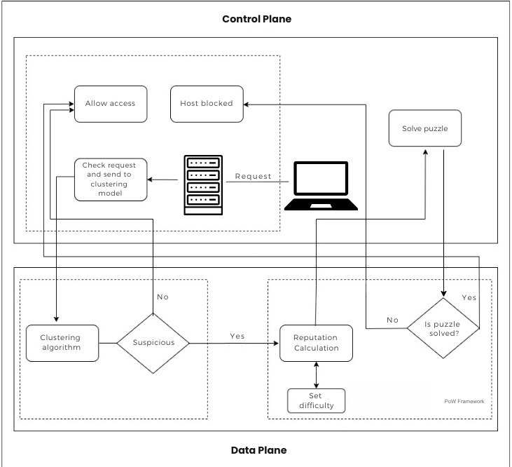

# DDoS Detection and Mitigation using Clustering & Reputation-based Proof of Work  

This project implements a **hybrid framework** for detecting and mitigating Distributed Denial of Service (DDoS) attacks. The system combines **unsupervised learning (clustering)** for anomaly detection with a **reputation-based Proof of Work (PoW)** mechanism that dynamically adjusts difficulty based on client behavior.  

It simulates both **malicious and legitimate clients**, interacting with a central **server** that monitors traffic, classifies behavior, and enforces adaptive defense strategies. 

## System Model  

Below is the system model diagram that illustrates the architecture of the proposed framework.  

  


---

##  Features  

- **Traffic Capture**: Captures live traffic using `tcpdump`.  
- **Feature Extraction**: Converts raw `.pcap` files into structured datasets using `ntlflowlyzer`.  
- **Unsupervised Learning**: Applies a clustering model to classify traffic as *suspicious* or *non-suspicious*.  
- **Dynamic Proof of Work**: Suspicious clients must solve cryptographic puzzles; difficulty depends on reputation score.  
- **Reputation System**: Clients gain or lose reputation based on past behavior and PoW validity.  
- **Simulation Environment**: Includes both normal and malicious clients for realistic testing.  

---

## 🏗️ System Architecture  

The framework consists of three main modules:  

1. **Data Capture Module**  
   - Collects raw packets using `tcpdump`.  
   - Converts `.pcap` traffic into structured CSV features.  

2. **Unsupervised Learning Module**  
   - Uses a clustering model to detect anomalies.  
   - Labels clients as *suspicious* or *non-suspicious*.  

3. **Reputation-based Proof of Work (PoW) Module**  
   - Suspicious clients must solve a PoW challenge.  
   - PoW difficulty depends on reputation:  
     - High reputation → easier puzzles.  
     - Low reputation → harder puzzles.  
   - Ensures attackers waste resources, while legitimate clients face minimal overhead.

---

## ⚙️ Prerequisites  

- **OS**: Ubuntu 20.04 / 22.04 (recommended)  
- **Python**: 3.8+  
- **Dependencies**:  
  ```bash
  pip install scikit-learn pandas numpy


---

## Tools
-tcpdump → for traffic capture

-ntlflowlyzer → for feature extraction

-hping3 → for attack traffic generation

-ping → for normal client simulation


### Install required tools:
```bash
sudo apt update
sudo apt install -y \
    tcpdump \
    hping3 \
    tshark \
    python3-pip \
    python3-venv \
    git \
    build-essential \
    libpcap-dev \
    ntlflowlyzer


```

## How to run
### 1. Start the server:
First, start the server using `python3 server.py`, which captures traffic, extracts features, classifies it with the clustering model, and issues PoW challenges to suspicious clients. 
```bash
python3 server.py
```

### 2. Run normal client :
```bash
python3 client_normal.py
```
### 2. Run Attack client :
```bash
python3 client_malicious.py
```

## Workflow  

- The client sends traffic, which the server captures using **tcpdump**.  
- The server extracts features from the captured traffic and applies the **clustering model**.  
- If the traffic is classified as **suspicious**, the server issues a **PoW challenge**.  
- The client solves the PoW and responds, after which its **reputation score** is updated.  
- Clients with **higher reputation** receive easier PoW challenges.  
- **Persistent attackers** face decreasing reputation, leading to harder PoW until eventually being **blocked**.  


## Screenshots  

This section contains execution and result screenshots from the implementation.  

  
  


